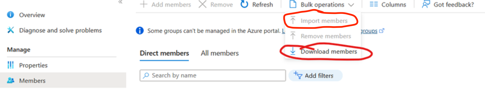

# Bulk add members to a Distribution Group in Exchange Online Shell

Because sometimes you just can't use the traditional `Bulk Import Members` button...

But that's really not a problem for a PowerShell Wizard :grin:

# Prerequisites

- you will need **PowerShell 7 or newer**
- you will need to install **Exchange Online module** for PowerShell

### 1. Create the distribution group

You can do this in the admin center and set your self as the owner. This will allow you to be able to run scripts on the group. No need to add anybody else at his point.

### 2. Set execution policy

Set the execution policy to remote signed from an elevated PowerShell window:
`Set-ExecutionPolicy RemoteSigned`

### 3. Import the Exchange Online module

Import the Exchange online Management module: `import-Module ExchangeOnlineManagement `

### 4. Connect Shell to Exchange Online

Connect the shell to Exchange Online and confirm the browser prompt: `Connect-ExchangeOnline -UserPrincipalName "yourname@yourdomain.com"`

### 5. Check connection

Check the connection by running: `Get-AcceptedDomain`. This should display a list of accepted domains.

### 6. Add the members

- Add the members to the distribution group with `Update-DistributionGroupMember -Identity "Group You Created Earlier" -Members john@company.com,jane@company.com,smith@company.com,etc,etc,etc`.
- it is important not to include spaces or new lines between the emails.
- emails must be separated with a `,` (comma) from each other.
- it is also possbile to read a list of emails from another file and insert it to the snippet as a variable `Update-DistributionGroupMember -Identity "Group You Created Earlier" -Members $listOfEmails`
- verify the terminal prompt

### 7. Confirm success

inspect the new distribution group in the admin center.

### Limitations and things to consider

- the cmdlet `Update-DistributionGroupMember` will overwrite your current distribution list. To avoid overwriting the list, backup the current list before you run the script on the group by selecting **Download members**:  
  
- if you forget to set your self as the owner of the group, you might not be able to run scripts on it.
