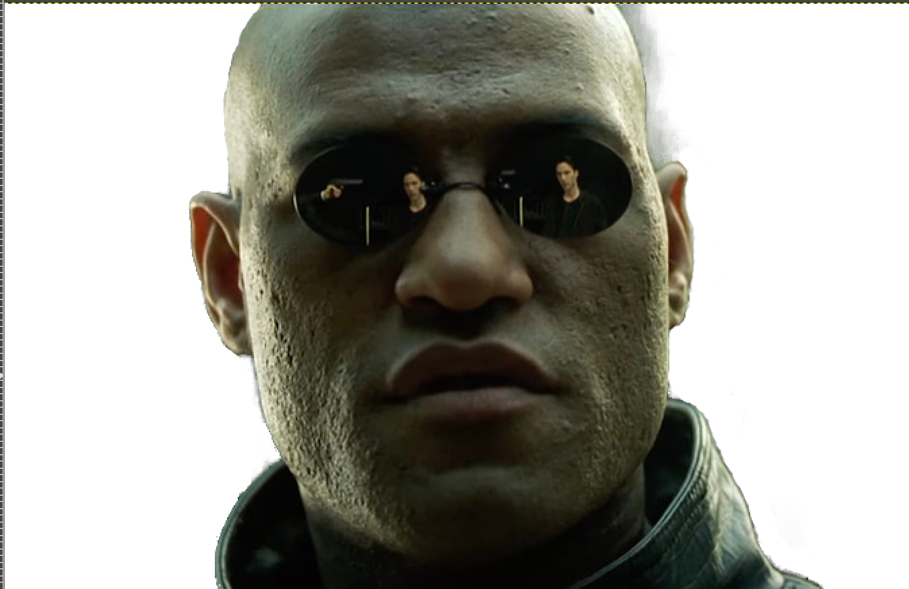

# Here's how to remove a background from an image with Gimp

Handy for when you run out of Photoshop licenses.

### 1. Launch Gimp and open your image

When you get the prompt dialogue, select keep and your image should open up.

### 2. Select the Foreground Select tool

**_Depress_** the Free Select tool and from there select the Foreground Select tool from the left side pane.

### 3. Draw Borders

With the Foreground Select tool draw a border around your subject.

Once you have drawn borders press enter and the photo will become blue.

### 4. Highlight the subject

While the picture is blue, you can paint the subject with the mouse to highlight what will be selected. Adjust instrument size using the left side pane.

A fully painted subject is yellowish. When you are done painting the subject press Preview Mask on the right, then press Select.

### 5. Cut

Dotted lines will appear around the subject.

Then press Select and Invert, and then precc CTRL + X to cut out the background.

Result:

Then press Select, None to unselect

### 6. Clean Up

With the eraser tool remove the unwanted pixels

### 7. Done

Morpheus is freed from the Matrix.

### [:point_left: back to main directory](https://github.com/Mike-ops273/sysadmin#a-repo-with-handy-tools-and-scripts-for-automating-tasks-rocket)
