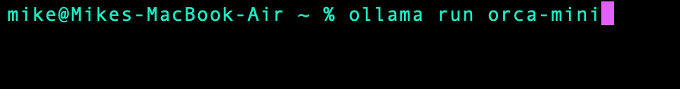

# Install a large language model (ai) on your local machine! :dizzy:

### 1. Download

Head over to [ollama.ai](https://ollama.ai/) and Download. Currently only supports MacOS and Linux with Windows coming soon.

### 2. Install

Unzip the download file and run the executable.

### 3. Choose a model

On the [project's github](https://github.com/jmorganca/ollama#model-library) is a list of models to choose from as well as Parameters and Size. Something to consider is that a smaller model is an easier workload, especially if you are running larger projects with containers or VMs at the same time.

Once you have selected a model run it's download command in the terminal:

When it's done it should look like this:

### 4. Give it a go:

Give your chosen model a prompt:

Well, seems like not all problems can be solved with ai :grin:

### 5. Final tips and tricks

By giving /? as a prompt you get a useful list of commands:

You can exit the session with /bye and return to your regular terminal.

The possibilities of what you do with your local LLM from here on out are endless, such as [customizing and building](https://github.com/jmorganca/ollama#customize-your-own-model) your own model!

One thing I should add is that the LLM does make my terminal look rather dope:

