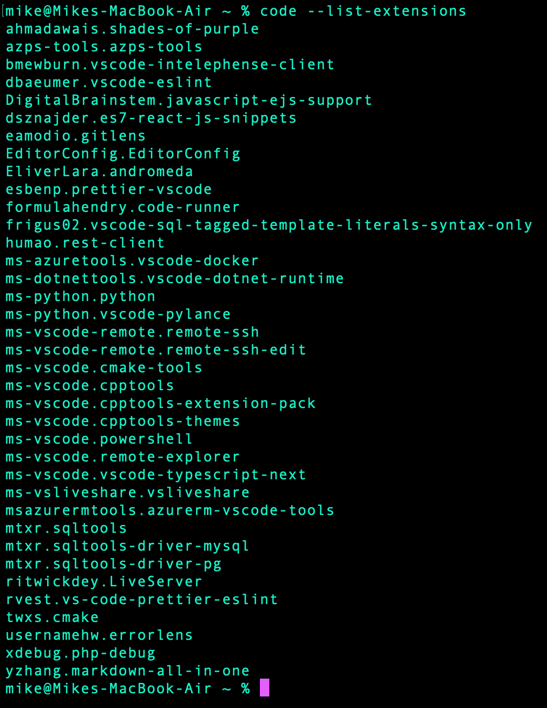

# Automate installing extensions on VSCode :wrench:

### Run the script:

Installs useful extensions and this is also a neat place to keep track of all my favrite extensions.

- run: `sudo zsh ./install-script.sh` in a terminal window.
- the `--force` flag is used to avoid all prompts and will install the latest verion of an extension.
- `--disable-extensions` will disable all extensions so that VSCode doesn't become sluggish. Manually turn them on when you use them.
- `--list-extensions` will list all installed extensions to the terminal.

### My current list of extensions:

### Happy scripting and fine tuning :grin:
